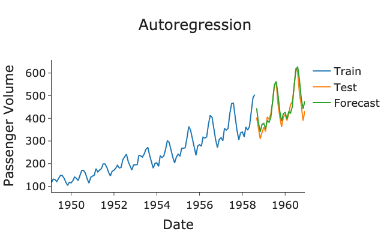

# Assignment 2

Total marks: 15 (This assignment total to 15, we will overall scale by a factor of 1)

For all the questions given below, create `assignment_q<question-number>_subjective_answers.md` and write your observations.

## Questions
## Assignment Question

### 1. Understanding Gradient Descent and Momentum [3 Marks]

Generate the following two functions:
Dataset 1:
```python
num_samples = 40
np.random.seed(45) 
    
# Generate data
x1 = np.random.uniform(-20, 20, num_samples)
f_x = 100*x1 + 1
eps = np.random.randn(num_samples)
y = f_x + eps
```

Dataset 2: 
```python
np.random.seed(45)
num_samples = 40
    
# Generate data
x1 = np.random.uniform(-1, 1, num_samples)
f_x = 3*x1 + 4
eps = np.random.randn(num_samples)
y = f_x + eps
```

-  **[2 marks]** Implement full-batch gradient descent and stochastic gradient descent for linear regression using the given datasets. Define the convergence criterion as reaching an $\epsilon$-neighborhood of the minimizer, with $\epsilon = 0.001$. Here, this means that your estimated parameter vector $\theta_t$ is considered to have converged once it is within a distance of $\epsilon$ from the true minimizer $\theta^\*$. Formally: $\|\theta_t - \theta^\*\| < \epsilon$ .For each method and dataset, determine the average number of steps required to satisfy this convergence criterion. Visualize the convergence process over 15 epochs.Provide visualizations:
    - Contour plots of the optimization process at different epochs (or an animation/GIF).
    - A plot of loss versus epochs for each method and dataset.


- **[1 marks]** Explore the article [here](https://machinelearningmastery.com/gradient-descent-with-momentum-from-scratch/#:~:text=Momentum%20is%20an%20extension%20to,spots%20of%20the%20search%20space.) on gradient descent with momentum. Implement gradient descent with momentum for the above two datasets. Visualize the convergence process for 15 steps. Compare the average number of steps taken with gradient descent (both variants full batch and stochastic) with momentum to that of vanilla gradient descent to converge to an $\epsilon$-neighborhood of the minimizer for both datasets. Choose $\epsilon = 0.001$. Write down your observations. Show the contour plots for different epochs for momentum implementation. Specifically, show all the vectors: gradient, current value of theta, momentum, etc. 


### 2. Effect Of Feature Scaling on Optimisation [2 Marks]

```python
num_samples = 100
np.random.seed(42)

# Generate data with large feature scale
x = np.random.uniform(0, 1000, num_samples)
f_x = 3 * x + 2
eps = np.random.randn(num_samples)
y = f_x + eps
```

- **[1 marks]** Using the above dataset, implement full-batch gradient descent for linear regression on the dataset above without any feature scaling. Define the convergence criterion as reaching an epsilon-neighborhood of the empirical least squares minimizer θ*, with ε = 0.001 ( $\|\theta_t - \theta^*\| < \epsilon$ ). Determine the number of iterations required to satisfy this convergence criterion. Plot mse loss versus iterations plot.

- **[1 marks]** Apply z-score normalization to the feature: $x_{\text{scaled}} = \frac{x - \mu_x}{\sigma_x}$ Run full-batch gradient descent on the scaled dataset with the same convergence criterion $(\epsilon = 0.001)$. Determine the number of iterations required for convergence. Plot mse loss versus iterations plot.

### 3. Working with Autoregressive Modeling [2 Marks]

- **[2 marks]**  Consider the [Daily Temperatures dataset](https://raw.githubusercontent.com/jbrownlee/Datasets/master/daily-min-temperatures.csv) from Australia. This is a dataset for a forecasting task. That is, given temperatures up to date (or period) T, design a forecasting (autoregressive) model to predict the temperature on date T+1. You can refer to [link 1](https://www.turing.com/kb/guide-to-autoregressive-models), [link 2](https://otexts.com/fpp2/AR.html) for more information on autoregressive models. Use linear regression as your autoregressive model. Plot the fit of your predictions vs the true values and report the RMSE obtained. A demonstration of the plot is given below. 


### 4. Implementing Matrix Factorization [6 Marks]

Use the [instructor's notebook](https://github.com/nipunbatra/ml-teaching/blob/master/notebooks/movie-recommendation-knn-mf.ipynb) on matrix factorisation, and solve the following questions.

**a) Image Reconstruction-** Here, ground truth pixel values are missing for particular regions within the image- you don't have access to them.

- **[2 Marks]** Use an image and reconstruct the image in the following two cases, where your region is-
    1. a rectangular block of 30X30 is assumed missing from the image. 
    2. a random subset of 900 (30X30) pixels is missing from the image. 

    Choose rank `r` yourself. Perform Gradient Descent till convergence, plot the selected regions, original and reconstructed images, Compute the following metrics:
    * RMSE on predicted v/s ground truth high resolution image
    * Peak SNR

    
- **[2 Marks]** Write a function using this [reference](https://pytorch.org/docs/stable/generated/torch.linalg.lstsq.html) and use alternating least squares instead of gradient descent to repeat Part 1, 2 of Image reconstruction problem using your written function. 

**b) Data Compression-** Here, ground truth pixel values are not missing- you have access to them. You want to explore the use of matrix factorisation in order to store them more efficiently.
- **[2 Marks]** Consider an image patch of size (NxN) where N=50. We are trying to compress this patch (matrix) into two matrices, by using low-rank matrix factorization. Consider the following three cases-
    1. a patch with mainly a single color.
    2. a patch with 2-3 different colors.
    3. a patch with at least 5 different colors.

    Vary the low-rank value as ```r = [5, 10, 25, 50]```  for each of the cases. Use Gradient Descent and plot the reconstructed patches over the original image (retaining all pixel values outside the patch, and using your learnt compressed matrix in place of the patch) to demonstrate difference in reconstruction quality. Write your observations. 

Here is a reference set of patches chosen for each of the 3 cases from left to right. 

<div style="display: flex;">


</div>

### 5. Logistic Regression in PyTorch [2 marks]

Implement logistic regression from scratch in PyTorch with an interface similar to scikit-learn’s `LogisticRegression`. Your implementation should support the following:

```python
class LogisticTorch:
    def __init__(self, lr=0.01, epochs=1000):
        pass

    def fit(self, X, y):
        pass

    def predict(self, X):
        pass

    def predict_proba(self, X):
        pass
```

Use the following dataset:

```python
from sklearn.datasets import make_moons

X, y = make_moons(n_samples=200, noise=0.2, random_state=42)
```

* Train your ```LogisticTorch``` classifier on this dataset.
* Compare the performance with ```sklearn.linear_model.LogisticRegression```.
* Plot the decision boundary for both models.
* Plot the loss curve during training.
* Report accuracy on the dataset for both models.


